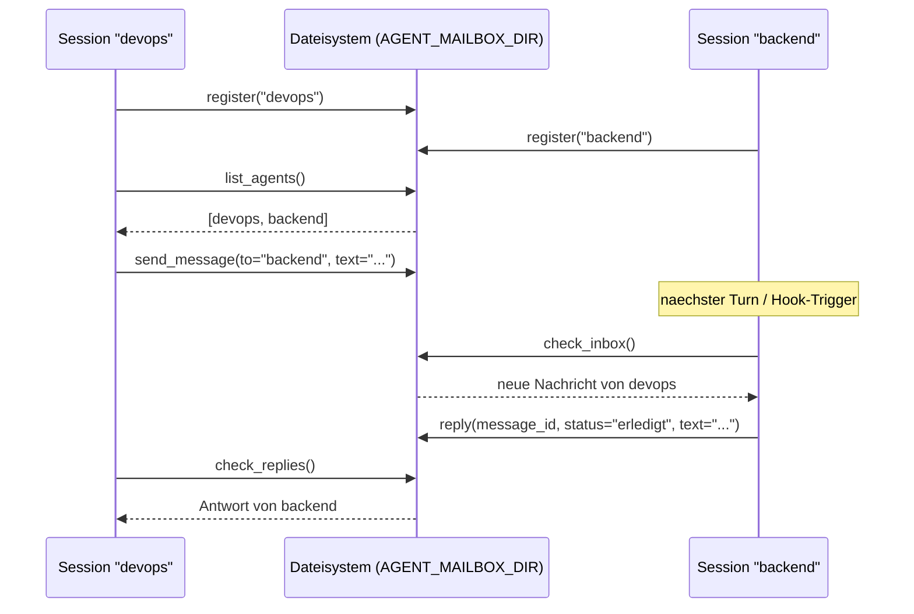

# Kiro Agent-Mailbox

MCP-Server für Cross-Session-Messaging zwischen gleichzeitig laufenden
[Kiro CLI](https://github.com/aws/kiro)-Terminal-Sessions (oder anderen
MCP-Clients) auf derselben Maschine.

## Problem

Mehrere Kiro-CLI-Sessions laufen parallel in verschiedenen Terminals — eine
arbeitet an einem Feature, eine andere an Infrastruktur/DevOps-Aufgaben. Häufig
entsteht während der Arbeit in Session A eine Anforderung, die eigentlich in
Session B gehört ("der Server braucht dafür einen neuen Endpoint", "das Deployment
muss angepasst werden"). Bisher musste man das manuell kopieren oder sich merken.

Agent-Mailbox löst das: Sessions registrieren sich unter einem frei wählbaren
Namen, können sich gegenseitig Nachrichten schicken, und die empfangende Session
antwortet, nachdem sie die Aufgabe umgesetzt (oder als Issue angelegt) hat.

## Funktionsweise



Kein Daemon, kein Netzwerk-Port: Jeder MCP-Tool-Call startet/nutzt den
Server-Prozess pro Session (stdio-Transport). Der eigentliche Zustand liegt
ausschließlich auf der Platte (JSON/JSONL-Dateien) und wird per `flock`
synchronisiert — dadurch funktioniert das Messaging auch zwischen völlig
unabhängigen Prozessen, solange sie auf dasselbe `AGENT_MAILBOX_DIR` zeigen.

**Wichtig:** Dies ist ein lokales Messaging-System für Sessions auf *derselben*
Maschine. Es gibt keine Netzwerkkomponente — für Cross-Rechner-Messaging müsste
`AGENT_MAILBOX_DIR` auf einen synchronisierten Speicherort zeigen (z.B. ein
Netzwerklaufwerk), was zusätzliche Vorsicht bei Nebenläufigkeit erfordert und
nicht Teil dieses Projekts ist.

## Tools

| Tool | Beschreibung |
|------|-------------|
| `register(name)` | Registriert die aktuelle Session unter einem frei wählbaren Namen |
| `list_agents(include_inactive=False)` | Listet alle registrierten Sessions mit Status |
| `send_message(to, text)` | Sendet eine Nachricht an eine andere registrierte Session |
| `check_inbox()` | Prüft die eigene Inbox auf neue Nachrichten, aktualisiert Heartbeat |
| `reply(message_id, status, text)` | Beantwortet eine Nachricht, Antwort geht an den Absender |
| `check_replies()` | Prüft, ob auf eigene gesendete Nachrichten geantwortet wurde |

## Installation

### Von PyPI

```bash
pip install kiro-agent-mailbox
```

### Mit uv

```bash
uv pip install kiro-agent-mailbox
```

### Aus dem Quellcode

```bash
git clone https://github.com/intershopper/kiro-agent-mailbox
cd kiro-agent-mailbox
pip install -e .
```

## Konfiguration

In `~/.kiro/settings/mcp.json` (global) oder `.kiro/settings/mcp.json` (Projekt):

```json
{
  "mcpServers": {
    "agent-mailbox": {
      "command": "agent-mailbox-mcp",
      "env": {
        "AGENT_MAILBOX_DIR": "~/.agent-mailbox"
      },
      "autoApprove": [
        "list_agents",
        "check_inbox",
        "check_replies"
      ]
    }
  }
}
```

- `AGENT_MAILBOX_DIR` ist optional — Default ist `~/.agent-mailbox`.
- Nur die lesenden Tools (`list_agents`, `check_inbox`, `check_replies`) sollten
  auto-approved werden. `register`, `send_message` und `reply` verändern Zustand
  bzw. stellen einer anderen Session etwas zu und sollten bestätigt werden.

### Automatisches Verhalten per Hooks (empfohlen)

Damit Sessions sich beim Start selbst anbieten und die Inbox bei jedem Turn
prüfen, in der Agent-Konfiguration (`~/.kiro/agents/<name>.json`):

```json
{
  "hooks": {
    "agentSpawn": [
      { "command": "echo 'Agent-Mailbox verfuegbar -- frage den User nach Registrierung (register-Tool)'" }
    ],
    "userPromptSubmit": [
      { "command": "echo '[Agent-Mailbox] check_inbox + check_replies aufrufen, falls registriert'" }
    ]
  }
}
```

Siehe [Kiro CLI Hooks-Dokumentation](https://kiro.dev/docs) für Details zum
Hook-System.

## Lebenszyklus / Heartbeat

- `check_inbox()` aktualisiert bei jedem Aufruf den Heartbeat der eigenen
  Registrierung.
- Sessions, die 30 Minuten lang nicht mehr `check_inbox` aufgerufen haben,
  gelten in `list_agents()` als inaktiv und werden standardmäßig ausgefiltert
  (nicht hart gelöscht — mit `include_inactive=True` weiterhin sichtbar).
- Ein Name, dessen Session abgelaufen ist, kann von einer neuen Session
  übernommen werden.

## Entwicklung

```bash
python3 -m venv .venv
source .venv/bin/activate
pip install -e ".[dev]"
pytest
```

## Lizenz

MIT, siehe [LICENSE](LICENSE).
